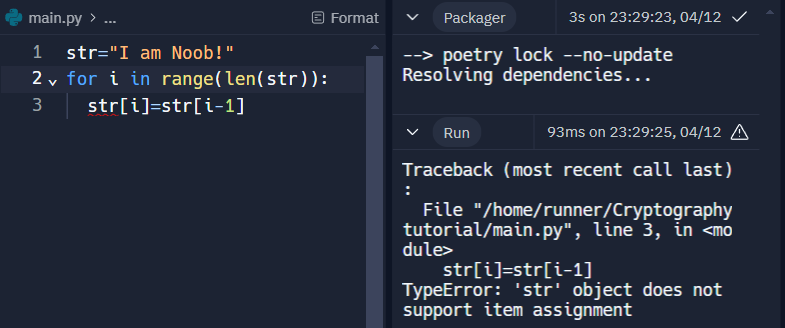

# Storing Data
## Making Data Base:
First we make a dictionary to store data of symbols as follows:
```python
dict={0:'A',1:'B',2:'C' ,3:'D' ,4:'E' ,5:'F' ,6:'G' ,7:'H' ,8:'I' ,9:'J',10:'K',11:'L' ,12:'M' ,13:'N' ,14:'O' ,15:'P',16:'Q' ,17:'R' ,18:'S' ,19:'T' ,20:'U',21:'V' ,22:'W' ,23:'X' ,24:'Y' ,25:'Z',26:' ',27:',',28:'.',29:'?',30:'0',31:'1',32:'2',33:'3',34:'4',35:'5',36:'6',37:'7',38:'8',39:'9',40:'!'}
```
Here basically we are mapping integers from 0-40 to alphabets and symbols such that Python understands and can manipulate Words with certain mathematical operations on it. The mathematical operations are discussed [here](00-preliminaries.md#encoding-function).

## How to Retrieve Data from Dictionary:
Now, to do mathematical operations we need to access Words' alphabets with their integer values. For example, Let's consider the word: "I am Noob!" Here we will make a list to store the alphabets in the given string:
```python
str="I am Noob!"
list=list(str)
```
Why to make it a list. We even can access all the alpabets and symbols as follows:
```python
for i in str:
  #required code
```
Actually strings are immutable that is can't be overwrite like:

```python
for i in range(len(str)):
  str[i]=str[i-1]
```
This will throw error if you run it:
```console
Traceback (most recent call last):
  File "/home/runner/Cryptographytutorial/main.py", line 3, in <module>
    str[i]=str[i-1]
TypeError: 'str' object does not support item assignment
```


We will now make one function to get keys corresponding to a certain value of dictionary:
```python
item=dict.items()

def get_key(val):
  for key, value in item:
    if val == value:
      return key

  return 0
```

Wrap up all together to make a file named dict.py if you want:
dict.py content:
```python
dict={0:'A',1:'B',2:'C' ,3:'D' ,4:'E' ,5:'F' ,6:'G' ,7:'H' ,8:'I' ,9:'J',10:'K',11:'L' ,12:'M' ,13:'N' ,14:'O' ,15:'P',16:'Q' ,17:'R' ,18:'S' ,19:'T' ,20:'U',21:'V' ,22:'W' ,23:'X' ,24:'Y' ,25:'Z',26:' ',27:',',28:'.',29:'?',30:'0',31:'1',32:'2',33:'3',34:'4',35:'5',36:'6',37:'7',38:'8',39:'9',40:'!'}
item=dict.items()

def get_key(val):
  for key, value in item:
    if val == value:
      return key

  return 0
```
We now see why this get_key() function is needed, [here]().\

[previous page](./00-preliminaries.md)\
[next page](./02-Affine_cipher.md)